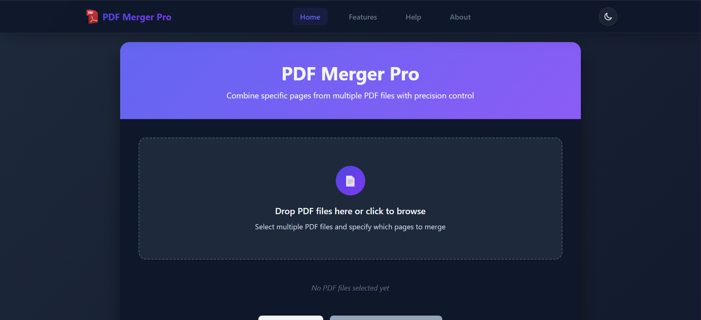

# PDF Merger Pro

A professional web application for merging PDF files with advanced features, built with modern web technologies. Merge, organize, and manage your PDF documents with ease while ensuring complete privacy as all processing happens directly in your browser.



## ✨ Features

- **Secure Local Processing** - All PDF operations happen in your browser; your files never leave your device
- **Advanced Page Selection** - Choose specific pages using checkboxes or range inputs (e.g., 1,3,5-7)
- **Intuitive Drag & Drop** - Easily reorder PDFs before merging with a simple drag-and-drop interface
- **Multiple Themes** - Light and dark mode with automatic system preference detection
- **Responsive Design** - Works seamlessly on desktop, tablet, and mobile devices
- **Cookie Consent** - GDPR-compliant cookie management with user preferences
- **Comprehensive Help** - Built-in help section and FAQ for easy guidance

## 🚀 Getting Started

### Prerequisites

- Modern web browser (Chrome, Firefox, Safari, Edge)
- No server or installation required

### Quick Start

1. Clone the repository:

   ```bash
   git clone https://github.com/yourusername/pdf-merger-pro.git
   cd pdf-merger-pro
   ```

2. Open `html/index.html` in your preferred web browser

   > For best experience, use a local web server:
   >
   > - VS Code with Live Server extension
   > - Python: `python -m http.server 8000`
   > - Node: `npx http-server -p 8000`

## 🖥️ How to Use

1. **Upload PDFs**

   - Drag and drop files or click to browse
   - Select multiple files at once

2. **Select Pages**

   - Check individual pages
   - Use range input for multiple pages
   - Preview pages before merging

3. **Organize & Merge**

   - Reorder PDFs using drag handles
   - Remove unwanted files
   - Click "Merge PDFs" to process

4. **Download**
   - Get your merged PDF instantly
   - All processing happens in your browser

## 🛠️ Technical Stack

| Component         | Technology                                    |
| ----------------- | --------------------------------------------- |
| Frontend          | HTML5, CSS3, Vanilla JavaScript               |
| PDF Processing    | [PDF-Lib](https://github.com/Hopding/pdf-lib) |
| UI Framework      | Custom CSS with CSS Variables                 |
| Icons             | Font Awesome 6.0                              |
| Responsive Design | CSS Grid & Flexbox                            |
| Local Storage     | For theme preferences and settings            |

## 📂 Project Structure

```
├── assets/
│   └── images/          # All image assets
│
├── html/                # HTML files
│   ├── index.html       # Main application
│   ├── about.html       # About page
│   ├── features.html    # Features overview
│   ├── help.html        # Help and FAQ
│   ├── privacy-policy.html  # Privacy policy
│   ├── cookie-policy.html   # Cookie policy
│   └── terms-of-service.html # Terms of service
│
├── styles/
│   └── style.css        # Main stylesheet
│
└── js/                  # JavaScript files
    ├── app.js           # Main application logic
    ├── script.js        # PDF processing
    ├── animations.js    # UI animations
    ├── themes.js        # Theme management
    └── cookies.js       # Cookie consent management
```

## 🌐 Browser Support

- Chrome (latest)
- Firefox (latest)
- Safari (latest)
- Edge (latest)
- Mobile Safari (iOS 12+)
- Chrome for Android

## 🔒 Privacy & Security

- No server-side processing
- No file uploads to external servers
- GDPR-compliant cookie management
- Clear privacy policy and terms of service

## 🤝 Contributing

Contributions are welcome! Please follow these steps:

1. Fork the repository
2. Create a feature branch: `git checkout -b feature/amazing-feature`
3. Commit your changes: `git commit -m 'Add some amazing feature'`
4. Push to the branch: `git push origin feature/amazing-feature`
5. Open a Pull Request

## 📄 License

This project is licensed under the MIT License - see the [LICENSE](LICENSE) file for details.

## 📧 Contact

<<<<<<< HEAD
For questions or support, please [contact us](mailto:nath.chandan1385@gmail.com) or open an issue on GitHub.
=======
For questions or support, please [contact us](mailto:nath.chandan1385.com) or open an issue on GitHub.
>>>>>>> 3d7048c11acbb6c5e7c4e6dbef78c097b69af10d

---

Made with ❤️ + PDF-Lib.
